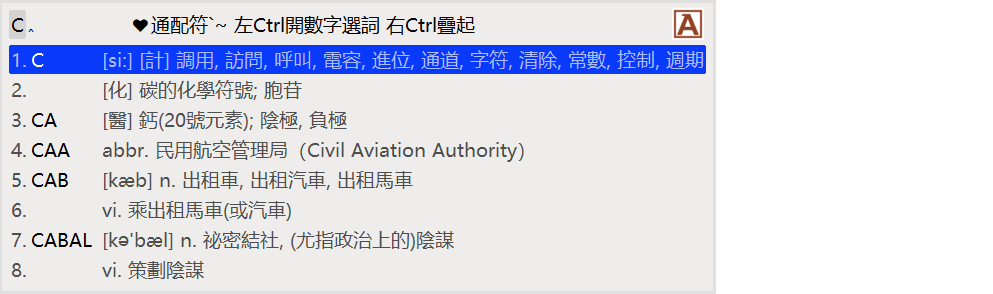

# Rime English輸入方案

本方案爲實現於Rime Weasel中文模式下輸入英文單詞而製作，所有功能均使用lua插件实现，請下載[Rime Weasel 0.14.3.148](https://bintray.com/rime/weasel/testing),librime-lua dll file(https://ci.appveyor.com/project/hchunhui/librime-lua/builds/35684423/artifacts) 。

## 功能說明：

- 在中文模式下增加 english 開關模式
- 支持大小寫混合輸入，候選單詞自動匹配。輸入模式儘量符合 英打模式 
- 在輸入過程中可使用通配符查詞   ？單字母 * 多字母 ex: be*ful 
- 符號或空格直接連候選詞一齊上屏，數字選字上屏 Tab complation function ex: be*ful Tab => beautiful
- 中文輸入法使用"朙月拼音"，請自行更改

## 詞典制作：
- 詞典來源於[skywind3000 ECDICT](https://github.com/skywind3000/ECDICT)
- 提供EXCEL文件<english.dict.xlsx>用於同步ECDICT及製作yaml詞典文件

